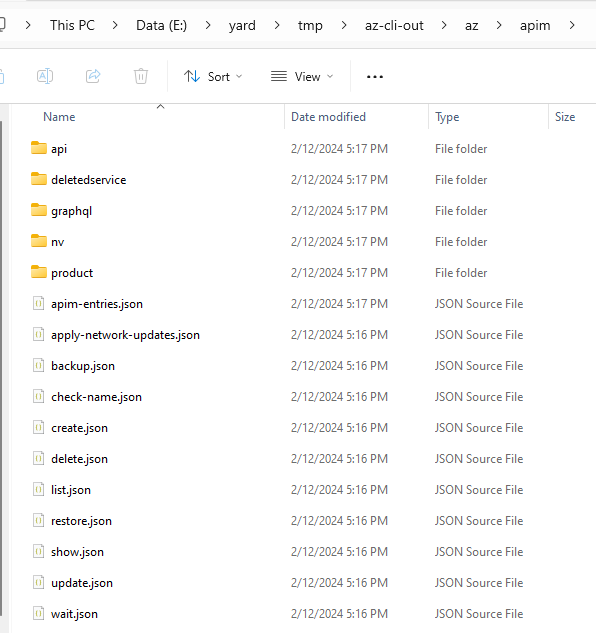
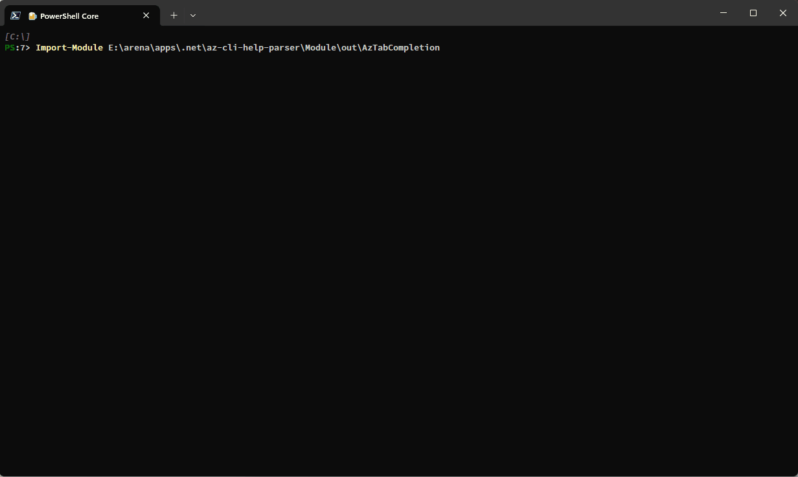

# Azure CLI Tab Completion

This is an experimental project to provide a highly responsive tab completion solution for Azure CLI commands.

The idea is simple:
- Azure CLI has high-quality well-formatted help content built in,
  which makes it possible to parse out the metadata information about all available commands.

- Deserialize the metadata information to disk with the pre-defined strucutre and folder layout,
  which is designed to be friendly for a tab completion module to access the data in a lazy manner --
  never pre-load any data, but only load the needed data for a specific tab completion request.

- Implement the tab completion module in C# based on the generated data set,
  and ship the data set along with the module for the specific version of the Azure CLI that we collected the data from.

## Code Structure

There are 3 .NET projects:
- [Abstraction](./Abstraction/): The abstraction layer depended by both [Module](./Module/) and [Parser](./Parser/).
  It defines the data structures representing `Group`, `Command`, and `Option`.
  The data structures are used by [Module](./Module/) and [Parser](./Parser/).
- [Module](./Module/): The implementation of the tab completion module.
- [Parser](./Parser/): It's an EXE tool that parses the help content for every Azure CLI command recursively, in a synchronous way.
  It generates metadata in JSON files as well as folder layout as it doing the parsing.

### Parser

To use the parser, simply run `dotnet run` within the `Parser` folder.
But before running it, you may want to change some configurations that are hard-coded today:

1. This parser prototype assumes to run on Windows.
1. You need to pass in the path to `az.cmd` when creating the `HelpParser`. (see code)
1. The default logging file is setup here in the code. You may want to change the log file path before starting.
1. It starts from parsing the `az` command, then it goes through all sub-group and sub-command of `az`,
   so on and so forth until it's done for all commands.
   When parsing the root command `az`, you need to specify the directory where all metadata will be generated in. (see code)

#### Generated Data

For every subgroup command, the parser creates a sub directory for it.
Within that directory, it generates a `<subgroup-name>-entries.json` file,
which is essentially a list of [`EntryInfo`](code) objects recording a brief summary of all the subgroup and leaf commands under the current subgroup command.

For every leaf command, the parser generate a `<command-name>.json` file within the directory of its parent subgroup command.
The JSON file has information about all options of the command, including the aliases of the option, the short flags of the option,
attribute of the option (e.g. preview, required), and static arguments for the option.

As an example, the data generated for `az apim` looks like this:



A package of the generated data `data.zip` is shared in the [samples folder](./assets/samples) as an example.

#### Examples Section

The parser parses the `Examples` section in the help content by default,
and it transforms the example text into the markdown format with the commands surrounded by `` ``` ``.
It can be disabled to reduce the size of the generated data,
see the `noExample` parameter in code.

#### Deprecated Commands and Options

All deprecated commands and options are skipped by design,
to discourage the use of them by hiding them in tab completion.

#### Logging

The parser logs about all deprecated commands and options that it skips,
as well as any recoverable errors it runs into during the parsing.
A sample log file [log1.txt](./assets/samples/log1.txt) is shared as an example to show the logging content.

#### Performance

It takes about 2.5 hours on my dev machine to finish parsing all Azure CLI commands.
This is because today
- The parsing happens synchronously.
- It's slow to get the help content by invoking `az <command> -h`.

The performance can be easily improved by
- Parsing different subgroup commands in parallel.
- Use the YAML help content from [MicrosoftDocs/azure-docs-cli](https://github.com/MicrosoftDocs/azure-docs-cli/tree/main/latest/docs-ref-autogen) instead of `az <command> -h`. Parsing YAML data would be much easier and faster than parsing the text data.

### Module

To build the tab completion module, run `dotnet publish` from within the `Module` folder.
The module will be deployed in the `Module/out` folder after the build.

Within [AzTabCompletion.psm1](./Module/AzTabCompletion.psm1),
you currently need to pass in the path to the root folder of the generated data,
so you will need to change the path appropriately before building the module. (see code)

As mentioned above, being fast is the goal of this module, so the module is designed to load data lazily.
It only load the needed data for a specific tab completion request.
Once that portion of data is loaded, it's cached,
so the next tab completion requiring the same data will be served using the cached data.

This module supports tab completion on sub command names, option names, and option arguments.
It's able to filter out the options that are already present in the command line,
and provides tooltips for command name and option completions,
which is especially helpful given that Azure CLI exposes lots of sub commands and options.

Currently, the option argument completion only supports the fixed enum arguments,
however, it's easy to support dynamic arguments by falling back to invoking `az`,
for options like `--resource-group` as an example.

A quick demo of the tab completion module in Action:



To try it out yourself, please
1. Download the `data.zip` package from the [sample folder](./assets/samples/) and extract all its content.
   You will see a folder named `az` after this step.
1. Update the path passed to the `GetSingleton` call in [AzTabCompletion.psm1](./Module/AzTabCompletion.psm1) to the path of the `az` folder.
1. Build the module by running `dotnet publish` from within the `Module` folder.
1. Import the module `AzTabCompletion` from the `Module/out` folder in PowerShell 7.2+ and try out any Azure CLI command.

### Uncovered Scenario and Possible Solutions

1. Dynamic argument completion. As mentioned above, this module can support dynamic argument completion by falling back to invoking `az`.
2. Azure CLI extensions. Need more thoughts on this, but as a trivial solution, we can also fall back to invoking `az` for extension commands.

### Known Issues

The tab completion module is designed to target `netstandard2.0`,
so that it can work in both Windows PowerShell and PowerShell 7+.
However, due to [this .NET issue](https://github.com/dotnet/runtime/issues/66232),
the `System.Text.Json` package doesn't work properly on .NET Framework,
even though the package declares that it supports `netstandard2.0`.

I will see if I can find a workaround to make it work on Windows PowerShell too.
